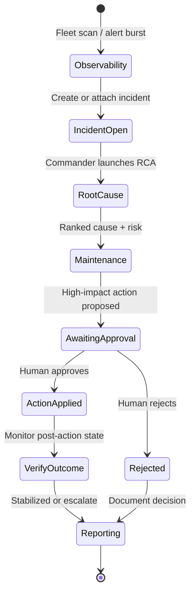

# SiliconPulse AI — Agent Design

> **Current maturity:** the browser and local demos implement deterministic, auditable workflow
> prototypes for RCA, maintenance approval, and reporting. They are not LLM-powered autonomous
> agents. The catalog below is the production design contract.

## Design rules

- Specialized agents with **limited responsibilities** — no unrestricted super-agent
- Each agent has: goal, tools, structured I/O (Pydantic), permissions, completion criteria, timeout, retry, audit log, confidence, escalation
- Communicate via **structured events** (Redpanda) + **durable state** (PostgreSQL) + **short locks** (Valkey)
- **No** shell access, source-code edits, or unapproved production-like mutations
- High-impact actions require **human approval** records before execution
- LLM may draft narratives; **tools and engines** supply facts

## Agent catalog

### Agent 1 — Fleet Observability Agent

| | |
| --- | --- |
| **Goal** | Reduce alert overload; prioritize meaningful fleet problems |
| **Responsibilities** | Fleet health, high-anomaly devices, rack patterns, group alerts, rank issues, fleet briefing, investigation requests |
| **Tools** | `get_fleet_summary`, `get_anomalous_devices`, `get_rack_health`, `get_device_state`, `get_open_alerts`, `create_incident`, `attach_alert_to_incident` |
| **Outputs** | Ranked issues, incident create/attach actions, briefing |
| **Escalation** | Conflicting rack vs device signals → Incident Commander |

### Agent 2 — Root-Cause Investigation Agent

| | |
| --- | --- |
| **Goal** | Rank likely causes from observed evidence only |
| **Responsibilities** | Telemetry, twin, peers, firmware, workload, maintenance, explanations, similar incidents, hypothesis testing, investigation report |
| **Tools** | `get_device_state`, `get_telemetry_history`, `get_peer_devices`, `get_rack_state`, `get_digital_twin`, `get_failure_prediction`, `get_model_explanation`, `get_firmware_history`, `get_workload_history`, `get_maintenance_history`, `search_similar_incidents`, `update_incident` |
| **Outputs** | Most likely cause, alternatives, supporting/contradicting/missing evidence, next checks |
| **Forbidden** | Using hidden simulator scenario labels as evidence |

### Agent 3 — Predictive Maintenance Agent

| | |
| --- | --- |
| **Goal** | Propose maintenance / simulated interventions with approval |
| **Responsibilities** | Failure probability, RUL, lifecycle, workload criticality, maintenance history, spare/window prototypes, draft plan, request approval, monitor outcome |
| **Tools** | `get_prediction`, `get_remaining_useful_life`, `get_workload_criticality`, `get_maintenance_windows`, `get_spare_inventory`, `create_maintenance_draft`, `request_approval`, `monitor_post_action_state` |
| **Approval required** | Workload redistribution, shutdown, firmware rollback, scheduling, retirement, limit changes |

### Agent 4 — Digital Twin Calibration Agent

| | |
| --- | --- |
| **Goal** | Distinguish device degradation from twin model drift |
| **Responsibilities** | Measure twin error, drift, firmware/peer changes, recommend recalibration, new twin version after approval |
| **Tools** | Twin metrics, firmware/peer queries, calibration proposal, approval hooks |

### Agent 5 — Incident Commander Agent

| | |
| --- | --- |
| **Goal** | Coordinate specialized agents through incident lifecycle |
| **Responsibilities** | Timeline, consolidate findings, detect conflicts, request approvals, track actions, verify outcomes, resolve readiness |
| **Tools** | Agent launch/status, incident timeline updates, approval, post-action verification |

### Agent 6 — Reporting Agent

| | |
| --- | --- |
| **Goal** | Evidence-linked incident reports |
| **Responsibilities** | Technical + executive reports; summarize evidence, actions, approvals, outcome; store in MinIO; link to incident |
| **Rule** | No report without evidence references |

### Agent 7 — Domain Adaptation Agent

| | |
| --- | --- |
| **Goal** | Onboard new telemetry schemas (esp. healthcare) safely |
| **Responsibilities** | Schema inspect, universal field map, domain fields, feature/algorithm recommendations, missing safety fields, onboarding report |
| **Rule** | Domain-expert review mandatory; healthcare non-diagnostic boundaries |

## Agent run model

Persisted fields (see domain model `AgentRun`):

- `agent_run_id`, `agent_type`, `incident_id`, `device_id`
- `status`, `started_at`, `completed_at`, `current_step`
- `tool_calls`, `observations`, `evidence`, `decisions`
- `confidence`, `approval_required`, `approval_status`, `output`, `error`

Each tool call records: run ID, tool name, input, output summary, timestamp, duration, success/failure, error, correlation ID.

## Orchestration

Events: `agent.events`, `agent.actions`, `agent.failures` plus incident/maintenance topics.

## Human approval workflow (summary)

Required before:

- Simulated workload redistribution, device shutdown, firmware rollback
- Maintenance scheduling, device retirement, operating-limit changes
- Healthcare-related actions

Approval record: ID, action, reason, expected impact, risk, requesting agent, timestamps, approver, decision, comments.

UI must expose approve/reject controls. Details: `docs/agents/APPROVAL_WORKFLOW.md` (Phase 13).

## Implementation phase

Agent runtime, tools, and UI are **Phase 13**. This document is the design contract for later implementation. Phase 0/1 does not implement agent code.
