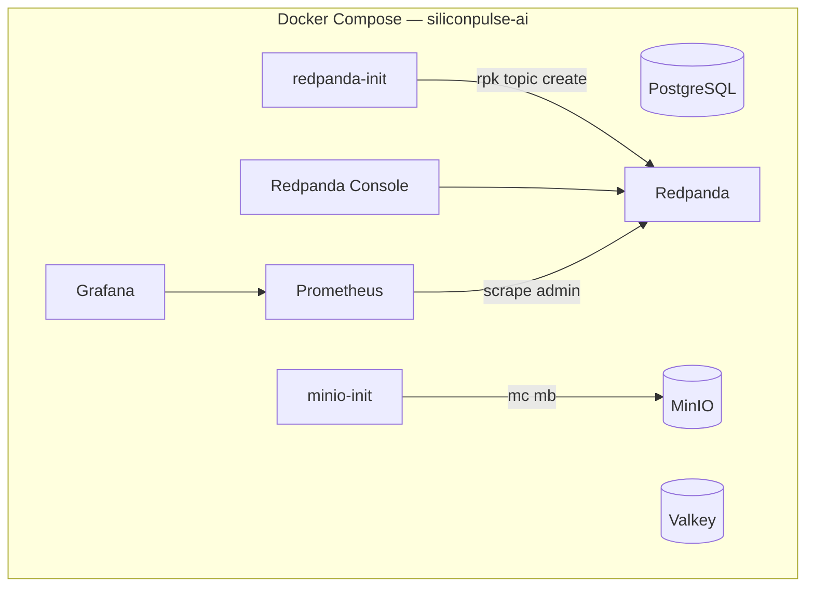

# Container Diagram

## Phase 2 infrastructure containers

## System context

See [SYSTEM_CONTEXT.md](SYSTEM_CONTEXT.md) for C4 Level 1/2 diagrams including future API/web/simulator containers.

## Data flow

See [DATA_FLOW.md](DATA_FLOW.md) for telemetry topic paths that will attach in Phases 3–4.
