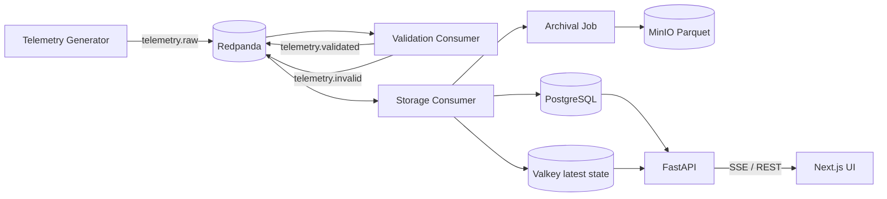
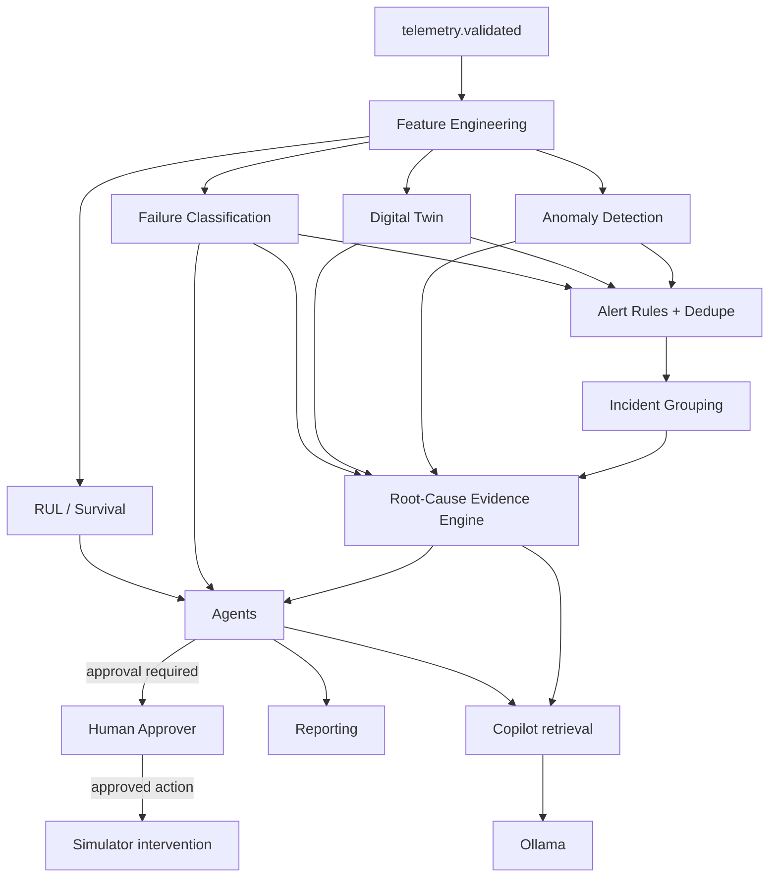
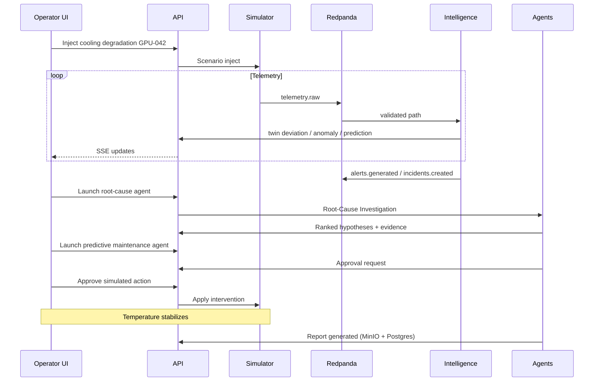

# SiliconPulse AI — Data Flow

## Principles

1. Telemetry is **event-driven** through Redpanda.
2. PostgreSQL is the **durable source of truth**.
3. Valkey is **ephemeral**: latest state, dedupe, locks, SSE fanout.
4. MinIO stores **large artifacts**: Parquet, models, reports.
5. Intelligence consumes validated telemetry / derived features — not raw unvalidated streams for decisions.
6. Generative AI explains **structured evidence**; it does not invent measurements.

## End-to-end telemetry path

### Non-negotiable rule

The simulator **must not** write live telemetry directly to PostgreSQL. Path is always:

`simulator → telemetry.raw → validation → telemetry.validated → storage → Postgres/Valkey`.

## Redpanda topics (v1)

| Topic | Producers | Consumers |
| --- | --- | --- |
| `telemetry.raw` | telemetry-generator | validation |
| `telemetry.validated` | validation | storage, alert, twin, prediction |
| `telemetry.invalid` | validation | monitoring / quarantine |
| `healthcare.telemetry` | healthcare simulator path | healthcare validation/storage |
| `device.events` | API / device registry | cache invalidation, audit |
| `alerts.generated` / `alerts.updated` | alert-service | incident grouping, API/SSE, agents |
| `predictions.generated` | prediction-service | API, agents, lifecycle |
| `digital-twin.updated` | digital-twin-service | API, alerts, agents |
| `incidents.created` / `incidents.updated` | incident module | API/SSE, agents, reporting |
| `maintenance.recommended` / `maintenance.approved` | maintenance / approvals | agents, API |
| `agent.events` / `agent.actions` / `agent.failures` | agent-service | audit, API/SSE, commander |
| `reports.generated` | reporting-service | API, MinIO link |

### Event envelope (all topics)

Every event includes:

- `event_id`, `event_type`, `schema_version`
- `created_at`, `correlation_id`, optional `causation_id`
- `source_service`, `payload`

Shared models live in `packages/shared-events`.

## Intelligence data flow

### Structured intelligence stack

| Layer | Responsibility | Must not |
| --- | --- | --- |
| Predictive models | Produce scores, classes, attributions | Claim real-world validation |
| Root-cause engine | Combine evidence, rank hypotheses | Use hidden scenario labels |
| Generative AI | Explain retrieved evidence | Invent telemetry or execute actions |
| Agents | Coordinate tools and workflows | Bypass approval or tool allowlists |

## Primary demo sequence (cooling degradation)

## Cache and consistency

| Data | System of record | Cache |
| --- | --- | --- |
| Historical telemetry | PostgreSQL (+ Parquet archive) | Short query caches optional |
| Latest device state | PostgreSQL `device_latest_state` | Valkey hot cache |
| Active alerts | PostgreSQL | Valkey + dedupe keys |
| Agent locks / workflow | PostgreSQL durable state | Valkey short locks |
| Models / reports | MinIO + metadata in Postgres | — |

## Healthcare path

Healthcare telemetry uses `healthcare.telemetry` (and domain tables/UI) with the same validation → storage pattern, plus mandatory safety disclaimers on every read/generated surface. Physiological signals are **simulated** and never used to infer medical conditions.
