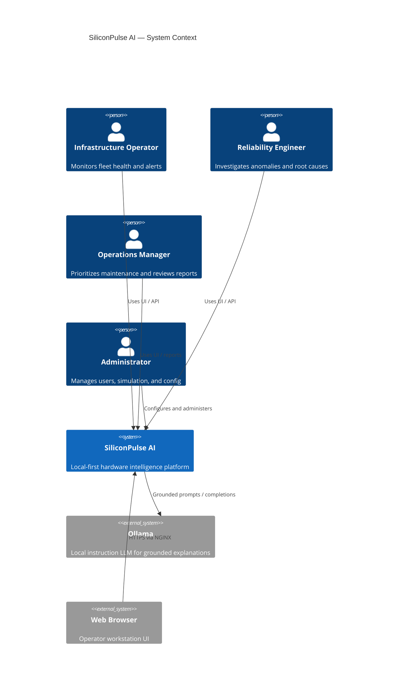
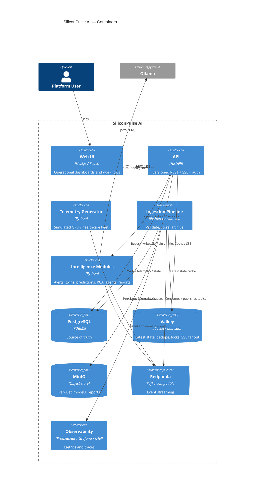

# SiliconPulse AI — System Context

## Purpose

Describe who uses SiliconPulse AI, what external systems it depends on (all local/self-hosted), and the major containers that make up the system.

## System context (C4 Level 1)



### External dependencies (local only)

| System | Role | Notes |
| --- | --- | --- |
| Ollama | Generative explanations | Optional at runtime; mock fallback in tests |
| Operator browser | UI | Next.js served behind NGINX |

No AWS, Azure, GCP, paid OpenAI, or paid observability SaaS.

## Container overview (C4 Level 2)



## Modular monolith principle

v1 favors **clear Python modules** with shared packages (`shared-models`, `shared-events`, `shared-db`, …) and a small set of runnable processes:

| Process | Responsibility |
| --- | --- |
| `apps/api` | HTTP API, auth, SSE, orchestration entrypoints |
| `telemetry-generator` | Simulation + scenario control |
| `ingestion-service` | Validate + store + archive consumers |
| Intelligence workers (may co-locate initially) | Alerts, predictions, twins, RCA, agents, reporting |

Separate Deployable folders under `services/` exist for future extraction. Co-location in fewer containers is preferred until scaling or ownership requires splits. **Document any co-location in `ARCHITECTURE.md`.**

## Trust boundaries

1. **Simulator → Redpanda only** for telemetry (never direct Postgres writes for live telemetry).
2. **LLM** receives grounded context only; cannot mutate state or invent telemetry as fact.
3. **Agents** call allowlisted tools; high-impact actions require human approval records.
4. **Healthcare domain** is isolated in API/UI with mandatory disclaimers.

## Deployment context (v1)

```text
Developer machine
  └── Docker Compose
        ├── infra (Postgres, Redpanda, Valkey, MinIO, Prometheus, Grafana, NGINX)
        ├── apps (api, web)
        ├── services (simulator, ingestion, intelligence workers)
        └── optional Ollama (host or container)
```

Kubernetes (kind + Helm) is a **later** demonstration only after Compose works end-to-end.
